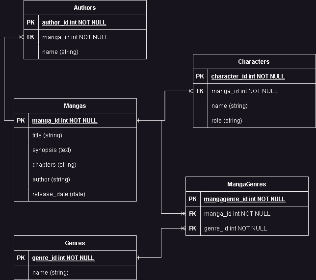

# Manga on Rails Data Project

## 1 - Gathering and Storing Data

### 1.1 - Describe Datasets

I'll be using the Jikan API to gather data about mangas. The Jikan API is an unofficial MyAnimeList API that provides access to detailed information about mangas, including their titles, synopses, genres, chapters, authors, publication dates, and characters.

#### Data Structure

The data from the Jikan API is structured in JSON format and includes the following key fields:
- `title`: The title of the manga.
- `synopsis`: A brief description of the manga.
- `genres`: An array of genres associated with the manga.
- `chapters`: The number of chapters in the manga.
- `authors`: An array of authors who worked on the manga.
- `published`: The publication dates of the manga.
- `characters`: An array of characters associated with the manga.

#### Required Database Tables and Columns

To store the manga data, we will create the following database tables:

1. **Mangas Table**
   - `title` (string): The title of the manga.
   - `synopsis` (text): A brief description of the manga.
   - `genre` (string): A comma-separated list of genres.
   - `chapters` (integer): The number of chapters in the manga.
   - `release_date` (date): The publication start date of the manga.

2. **Characters Table**
   - `name` (string): The name of the character.
   - `description` (text): A brief description of the character.
   - `manga_id` (integer): Foreign key to the `mangas` table.

3. **Genres Table**
   - `name` (string): The name of the genre.

4. **MangaGenres Table** (Join table for many-to-many relationship between mangas and genres)
   - `manga_id` (integer): Foreign key to the `mangas` table.
   - `genre_id` (integer): Foreign key to the `genres` table.

5. **Authors Table**
   - `name` (string): The name of the author.
   - `manga_id` (integer): Foreign key to the `mangas` table.

#### Integration

The data pulled from the Jikan API will be used to populate the `mangas`, `characters`, `genres`, `manga_genres`, and `authors` tables in the database. Each manga entry will include information about its title, synopsis, genres, chapters, authors, and publication dates. The characters associated with each manga will be stored in the `characters` table, and the genres will be stored in the `genres` table. The `manga_genres` join table will establish the many-to-many relationship between mangas and genres. The `authors` table will store information about the authors of each manga.

### 1.2 - Database ERD

## Entity-Relationship Diagram

